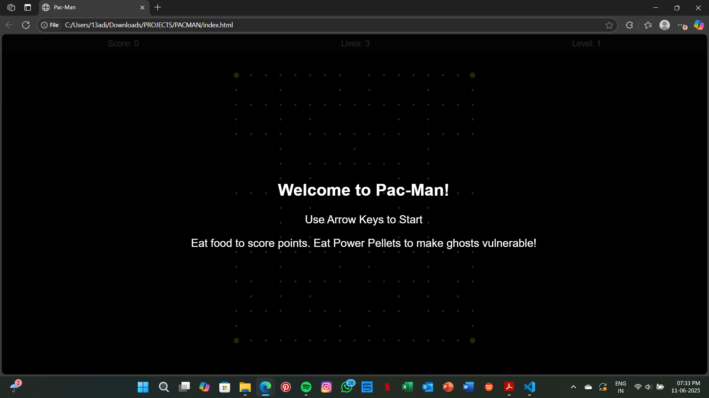
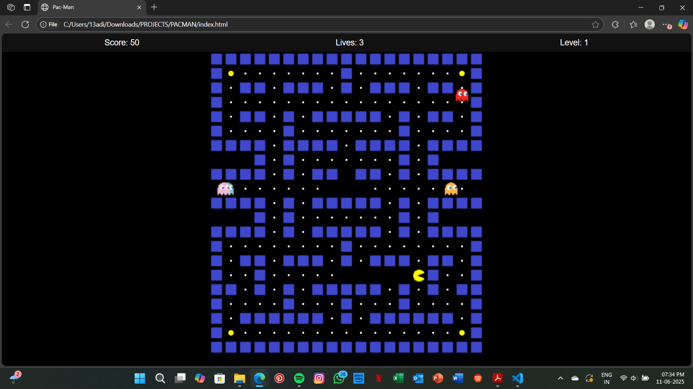
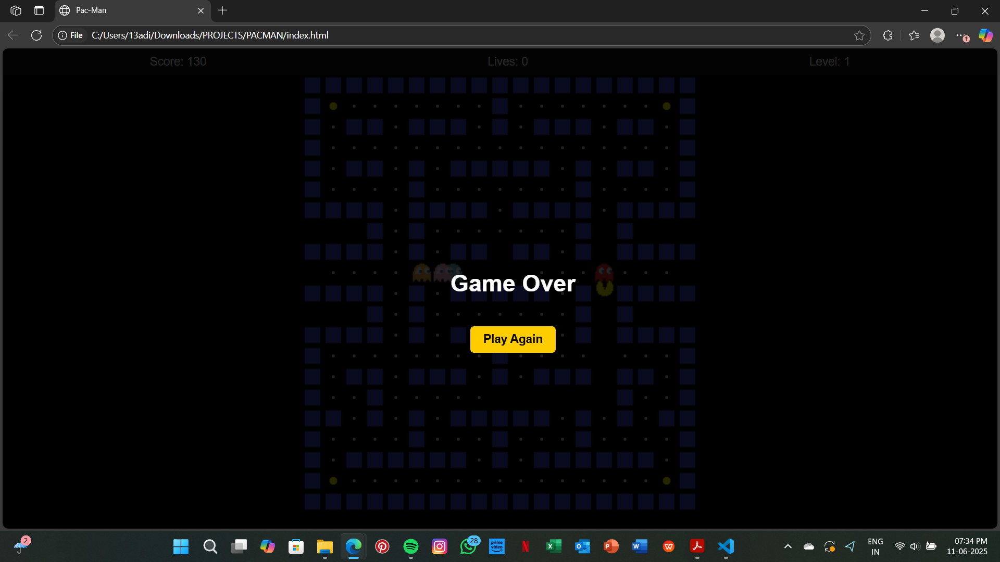

# 🍒 PacManJS  
👻🟡 A classic Pac-Man clone built with **HTML**, **CSS**, and **JavaScript**, now supercharged with power-ups, overlays, and UI enhancements!

---

## 🎮 Features

- **Classic Pac-Man gameplay** — eat pellets, avoid ghosts, collect fruits, and level up!
- **Power Pellets** — turn the tables! Eat special corner pellets to make ghosts vulnerable.
- **Ghost Vulnerability Mode** — chomp blue ghosts for bonus points during power mode.
- **Fruit Bonuses** — cherries and bonus fruits appear randomly for extra points.
- **Animated Pac-Man Death** — watch Pac-Man flash dramatically when caught.
- **Start Screen** — immersive welcome screen with instructions and automatic game start on key press.
- **Game Over Screen** — stylish “Play Again” button to restart seamlessly.
- **Dynamic HUD** — on-screen panel shows live score, lives left, and current level.
- **Responsive Controls** — smooth keyboard support with arrow keys or WASD.

---

## 🕹️ How to Play

- Use the arrow keys (`↑ ↓ ← →`) or `WASD` to move Pac-Man.
- Eat small pellets to score 10 points each.
- Grab power pellets in the 4 corners to enter ghost-eating mode.
- Eat scared ghosts for **200 bonus points** each!
- Catch randomly spawning fruits for extra points.
- Avoid ghosts when not powered up — losing all 3 lives ends the game.
- Use the "Play Again" button to reset and try again!

---

## 🛠️ Technologies Used

- **HTML5** — layout, canvas rendering, and overlays  
- **CSS3** — styling, game screens, themes, and button design  
- **JavaScript** — full game logic, animations, collision detection, score tracking, and UI control  

---

## 💻 How to Run Locally

1. Clone the repository:

   ```bash
   git clone https://github.com/yourusername/pacman-js.git
   
2. Open `index.html` in your favorite web browser.

3. Start playing!

## Screenshots

Here are some screenshots of the game:







## Future Improvements
- Add sound effects for movement, pellet munching, ghost capture, and death.
- Track and display high scores using localStorage.
- Add multiple difficulty levels with faster ghost speed.
- Include a mobile-friendly virtual D-Pad for touch devices.
